<p align="center">
  
</p>

<p align="center">
  
  
  
  
  
  
</p>

<p align="center">
  <strong>Learn · Build · Deploy · Improve</strong><br />
  <span style="color:#94a3b8">Turning ideas into practical, reliable systems through continuous learning and iteration.</span>
</p>

---

## My workflow

I work iteratively:

```text
LEARN  →  BUILD  →  DEPLOY  →  IMPROVE
```

I learn from problems, build small useful systems, put them into real
environments, and improve them through feedback. Technology changes; the
workflow stays consistent.

## Selected work

These are examples of projects built through the workflow—not the entire
scope of my work.

### Modbus AWS Logger — private preview

A focused **Modbus TCP → AWS IoT Core** bridge written in Python.

**Implemented:**

- Persistent Modbus TCP holding-register scanning
- AWS IoT MQTT/TLS publishing with QoS 1
- Environment-based configuration with no credentials in source control
- PLC and MQTT reconnect handling
- Offline `--check-config` and safe `--demo` modes
- Optional SMTP daily operational summaries with duplicate-send protection
- Unit tests, dependency checks, secret-pattern checks, and GitHub Actions CI
- Deployment documentation for a Raspberry Pi 5 edge host

[Open the private project repository](https://github.com/mosesnetto/modbus-aws-logger) · **private preview**

### Reference edge deployment

The companion deployment pattern uses a **Raspberry Pi 5 with 4 GB RAM** as the
site edge host:

- **Tailscale VPN** connects multiple authorized devices through a private tailnet.
- **Flask UI/API** provides a browser or API interface on the local network.
- **xrdp** provides open-source remote desktop access over TCP/3389.
- **Modbus AWS Logger** reads the PLC and publishes telemetry to AWS IoT.
- AWS IoT MQTT/TLS remains a separate, authenticated cloud connection.

The Flask application and operating-system services are documented as a
companion deployment pattern; they are not automatically provisioned by the
logger repository.

<p align="center">
  
</p>

---

## Engineering principles

<table>
  <tr>
    <td width="33%" align="center">
      <strong>🔐 Secrets stay out of Git</strong><br />
      <span style="color:#64748b">Environment files, certificates, private keys, logs, and runtime state stay local.</span>
    </td>
    <td width="33%" align="center">
      <strong>🧪 Offline validation first</strong><br />
      <span style="color:#64748b">Demo and configuration checks make it possible to verify behavior before touching a PLC or cloud account.</span>
    </td>
    <td width="33%" align="center">
      <strong>🔒 Least privilege by design</strong><br />
      <span style="color:#64748b">Tailscale access is restricted by device and port; AWS IoT access is restricted by certificate and topic policy.</span>
    </td>
  </tr>
  <tr>
    <td align="center">
      <strong>📡 Useful telemetry</strong><br />
      <span style="color:#64748b">Structured JSON payloads preserve operational context for later analysis.</span>
    </td>
    <td align="center">
      <strong>🧱 Small, testable pieces</strong><br />
      <span style="color:#64748b">Clear modules, repeatable checks, and honest documentation over unsupported claims.</span>
    </td>
    <td align="center">
      <strong>🛠️ operable systems</strong><br />
      <span style="color:#64748b">Reconnects, summaries, CI, and deployment notes are part of the product—not afterthoughts.</span>
    </td>
  </tr>
</table>

---

## What we can implement next

These are concrete next steps, not claims about current functionality:

- [ ] A secure Flask control plane with authentication, role-based access, and read-only telemetry views
- [ ] A Modbus simulator for safe development and commissioning
- [ ] Health/readiness status and connection/publish metrics
- [ ] Payload schema versioning and migration policy
- [ ] Docker, systemd, and Windows service deployment profiles
- [ ] Tailscale policy templates for Pi, Flask, xrdp, and PLC subnet access
- [ ] Alert policies for stale telemetry, repeated Modbus failures, and broker outages
- [ ] Public documentation and a customer commissioning guide after the security and license review

---

## Current stack

<p align="center">
  
  
  
  
  
  
  
  
</p>

---

## More public work

### Career Guidance Chatbot

[ChatBot-For-Carrier-Guidance](https://github.com/mosesnetto/ChatBot-For-Carrier-Guidance) ·
Python · PyTorch · NLTK · Flask

An offline AI career-guidance chatbot with intent classification, confidence
gating, a web chat UI, a terminal interface, reproducible training, tests, and
CI.

### MCC Machine Shift Monitor

[machine-monitor](https://github.com/mosesnetto/machine-monitor) ·
Python · Raspberry Pi 5 · Telegram · 4G/A7670E

A Raspberry Pi 5 machine-shift monitor with downtime alerts, shift-aware
reports, offline text-to-speech, and optional real phone-call notifications.

---

## GitHub

<p align="center">
  <a href="https://github.com/mosesnetto">
    
  </a>
</p>

<p align="center" style="color:#64748b">
  Building secure industrial telemetry from the edge to the cloud.
</p>
